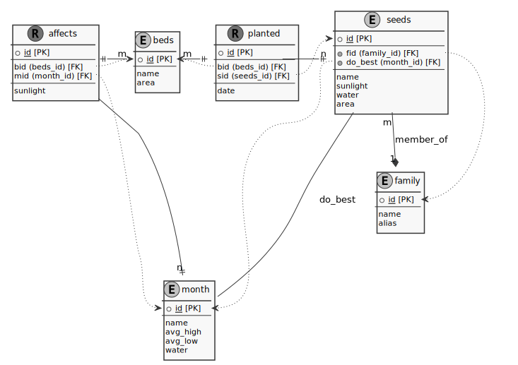

# garden_tracker
simple database to track and plan your garden

# Garden Tracking App #
---

> Can't live with database can't live without database.

## ¿Que es? ##
This is a database to track the plants grown in one's backyard garden. There could be many raised beds and hundreds of seeds to track. I hope it can be used to streamline planting and maximize productivity of the garden so you can figure out what to plant each month. You can follow to the link to each of the table to interact with the database and use the planning page to schedule the garden plants. 

## Schema ##

